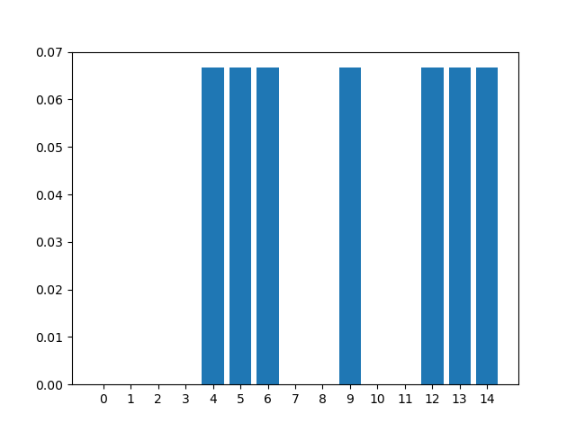

## Simulacion Cuantica 
* SimulacionCuantica.py es una Libreria que permite diseñar y probar distintos experimentos al estilo doble rendija y multirendija tanto probabilistico como cuántico , en donde se permiten realizar las siguientes operaciones:
>- Experimento Multirendijas cuantico.
>- Experimento Multirendijas probabilistico.
>- Graficar vectores (Matplotlib).

## Comenzando 🚀
* Clone éste repositorio en su máquina local usando [ComplexNumbers](https://github.com/JCPosso/complexNumbers.git)- Repositorio

Para un buen Uso de la Libreria es Necesario  que al hacer uso de las distintas funciones de 'SimulacionCuantica.py' es necesario conocer los distintos parámetros de ambas funciones las cuales son:

* n_rendijas = Numero de rendijaas del sistema
* n_blancos = Numero de blancos del sistema
* vector_prob = Un vector de probabilidad de clase matriz , con las probabilidades de ir de cada rendija a cada uno de sus objetivos , o también se puede ingresar el numero de probabilidad asociado en el caso de los experimentos multirendija probailisticos  .

El nommbre de cada una de las funciones con susrespectivos prametros son :
```
>-experimento_multirendija_cuantico(n_rendijas,n_blancos,vector_prob) 
 --->retorna : Matriz final con sus respectivas interferencias  y vector final caracteristico asociado al sistema
 
>-experimento_multirendija_probabilistico(n_rendijas,n_blancos,vector_prob)
 --->retorna : Matriz construida  a partir de los datos ingresados y vector final caracteristico asociado al sistema
```
### Pre-requisitos 📋
* Libreria MatPlotLib
* Sistemas operatrivos: mac , linux o windows.
* Editor de archivos .py

Python 3

```
How to install python 3?
Step 1: Download the Python 3 Installer. Open a browser window and navigate to the Download page for Windows at python.org. ...
Step 2: Run the Installer. Once you have chosen and downloaded an installer, simply run it by double-clicking on the downloaded file.

```
Git(opcional)
```
¿Como descargar git?

1.- Descargando Git
Para poder utilizar Git en nuestro equipo es importante realizar la descarga del software que contiene todos los comandos para poder gestionarlo.
Como primer paso nos dirigimos a la ruta https://git-scm.com/ para realizar la descarga,dando clic en la imagen del monitor que se encuentra a un costado, el cual contiene la descripción “Download NumeroVersion for windows”

2.- Ejecutando el instalador de git
Una vez descargado, daremos doble clic en el instalador y nos aparecerá la primera pantalla, donde daremos Next(Siguiente)

3.- Configurando ruta de instalación
Nos aparece otra ventana donde indicaremos la ruta donde deseamos guardar los archivos de configuración de Git, nosotros por lo pronto, la dejaremos así, pero puedes elegir la ruta que desees, daremos clic en Next(Siguiente)

4.- Configurando instalación de Git
En la siguiente pantalla nos muestra algunas configuraciones que podemos cambiar, como el editor de texto, si queremos colocar un icono en el escritorio y demás, por lo pronto lo dejaremos así, solo daremos clic en Next(Siguiente)

5.-Comprobando la instalación         
Para comprobar que Git se instaló correctamente solo vamos a Windows -> y escribimos Git, veremos que aparecerán los programas básicos para comenzar a trabajar con Git.
```
### Instalación 🔧
* Descargue los archivos de libreria
* Ponga las librerias en la carpeta en la cual se encuentra el proyecto
* Importe la libreria al archivo .py del proyecto
* Utilizce las funciones de libreria .

* *siga instrucciones en https://git-scm.com/book/en/v2/Getting-Started-Installing-Git para ejecutar un entorno de desarrollo en git

## Ejecutando las pruebas ⚙️
Para ejecutar los test debe descargar el archivo 'test_simulClassicToCuant.py' en donde se encuentra distintos experimentos con sus respectivas gráficas asociadas .
Ejecute las prueblas 'test_simulClassicToCuant.py' .
Pruebas test_clasicTocuant.py Para revisar funcionamiento de las funciones para n-rendijas de forma probabilistica o cuantica.

### Pruebas end-to-end 🔩
Se realizaron para ver su funcionamiento en sistemaas multirendija para dos y tres rendijas  probabilisticas como cuanticas.
A continuacion ,un Ejemplo de prueba para ver fenomeno interferencia para 3 rendijas cuantico y comprobar que la matriz resultante y el estado asociado al sistema sea el esperado :
```
        def test02_Multirendija_Cuantico_TresRendijas(self):
                v= matriz([ [[-math.sqrt(10)/10,math.sqrt(10)/10]],[[-math.sqrt(10)/10,math.sqrt(10)/10]],[[-math.sqrt(10)/10,-math.sqrt(10)/10]],[[math.sqrt(10)/10,-math.sqrt(10)/10]],[[math.sqrt(10)/10,-math.sqrt(10)/10]] ])
                matrizCaminos, estado     =    experimento_multirendija_cuantico(3,11,v)
                
 ### Aquí comprobamos que los resultados sean los esperados:            
 
                self.assertTrue(matrizCaminos ==matriz([ [  [0,0],[0,0],[0,0],[0,0],[0,0],[0,0],[0,0],[0,0],[0,0],[0,0],[0,0],[0,0],[0,0],[0,0],[0,0] ],
                                                          [ [0,0],[0,0],[0,0],[0,0],[0,0],[0,0],[0,0],[0,0],[0,0],[0,0],[0,0],[0,0],[0,0],[0,0],[0,0] ],
                                                          [ [0,0],[0,0],[0,0],[0,0],[0,0],[0,0],[0,0],[0,0],[0,0],[0,0],[0,0],[0,0],[0,0],[0,0],[0,0] ],
                                                          [ [0,0],[0,0],[0,0],[0,0],[0,0],[0,0],[0,0],[0,0],[0,0],[0,0],[0,0],[0,0],[0,0],[0,0],[0,0] ],
                                                          [ [1/15,0],[1/5,0],[0,0],[0,0],[1,0],[0,0],[0,0],[0,0],[0,0],[0,0],[0,0],[0,0],[0,0],[0,0],[0,0] ],
                                                          [ [1/15,0],[1/5,0],[0,0],[0,0],[0,0],[1,0],[0,0],[0,0],[0,0],[0,0],[0,0],[0,0],[0,0],[0,0],[0,0] ],
                                                          [ [1/15,0],[1/5,0],[0,0],[0,0],[0,0],[0,0],[1,0],[0,0],[0,0],[0,0],[0,0],[0,0],[0,0],[0,0],[0,0] ],
                                                          [ [0,0],[1/5,0],[1/5,0],[0,0],[0,0],[0,0],[0,0],[1,0],[0,0],[0,0],[0,0],[0,0],[0,0],[0,0],[0,0] ],
                                                          [ [0,0],[1/5,0],[1/5,0],[0,0],[0,0],[0,0],[0,0],[0,0],[1,0],[0,0],[0,0],[0,0],[0,0],[0,0],[0,0] ],
                                                          [ [1/15,0],[0,0],[1/5,0],[0,0],[0,0],[0,0],[0,0],[0,0],[0,0],[1,0],[0,0],[0,0],[0,0],[0,0],[0,0] ],
                                                          [ [0,0],[0,0],[1/5,0],[1/5,0],[0,0],[0,0],[0,0],[0,0],[0,0],[0,0],[1,0],[0,0],[0,0],[0,0],[0,0] ],
                                                          [ [0,0],[0,0],[1/5,0],[1/5,0],[0,0],[0,0],[0,0],[0,0],[0,0],[0,0],[0,0],[1,0],[0,0],[0,0],[0,0] ],
                                                          [ [1/15,0],[0,0],[0,0],[1/5,0],[0,0],[0,0],[0,0],[0,0],[0,0],[0,0],[0,0],[0,0],[1,0],[0,0],[0,0] ],
                                                          [ [1/15,0],[0,0],[0,0],[1/5,0],[0,0],[0,0],[0,0],[0,0],[0,0],[0,0],[0,0],[0,0],[0,0],[1,0],[0,0] ],
                                                          [ [1/15,0],[0,0],[0,0],[1/5,0],[0,0],[0,0],[0,0],[0,0],[0,0],[0,0],[0,0],[0,0],[0,0],[0,0],[1,0] ], ] ))
               
                self.assertTrue(estado == matriz([ [[ 0,0 ]],[[ 0,0 ]],[[ 0,0 ]],[[ 0,0 ]]
                                                ,[[1/15,0]],[[ 1/15,0]],[[ 1/15,0]],
                                                [[ 0,0 ]],[[ 0,0 ]],[[1/15,0]],[[ 0,0 ]],[[ 0,0 ]],
                                                [[ 1/15,0]],[[ 1/15,0]],[[ 1/15,0]] ]))
                graficar(estado)
```
Como al final hicimos uso de la funcion 'graficar(estado)' ,obtenemos el siguiente diagrama de barras correspondiente al estado final del sistema el cual permite ver de manera clara su comportamiento final Y el distintivo patron de interferencia asociado:



## Autor(es) ✒️

* **Juan Camilo PossoG.** - *Initial work* - [JCPosso](https://github.com/JCPosso)

* Personas que han contribuido al proyecto : [contribuyentes](https://github.com/JCPosso/complexNumbers/contributors)

## Referencias
Inspirando en:

*Michael A. Nielsen, Isaac L. Chuang. Quantum Computation and Quantum Information (10th Anniversary edition). Cambridge University Press. 2016
