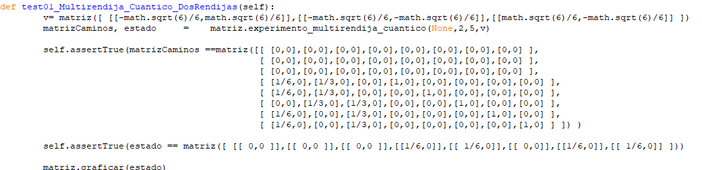
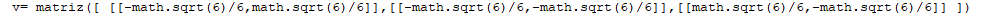
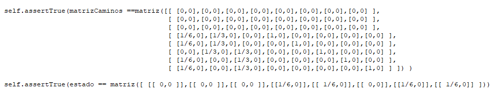
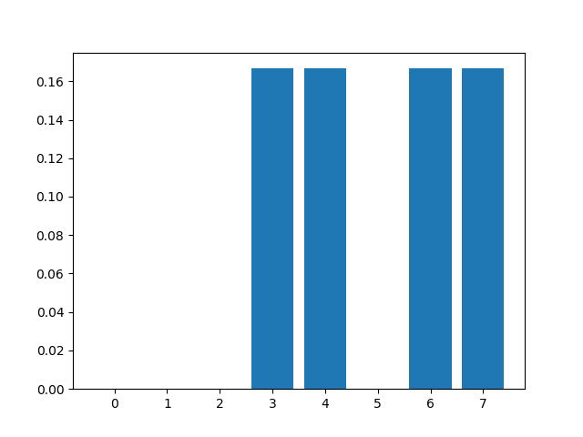
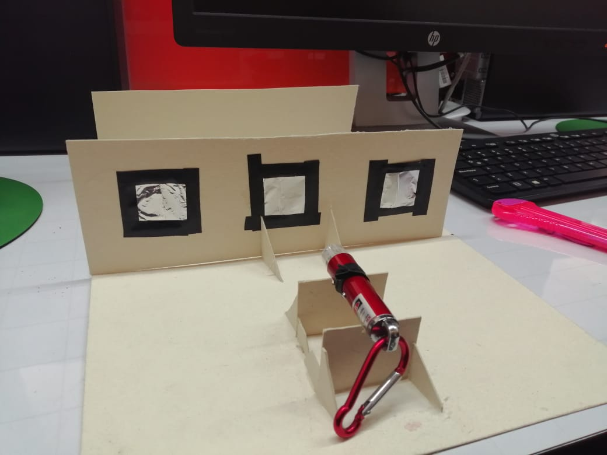
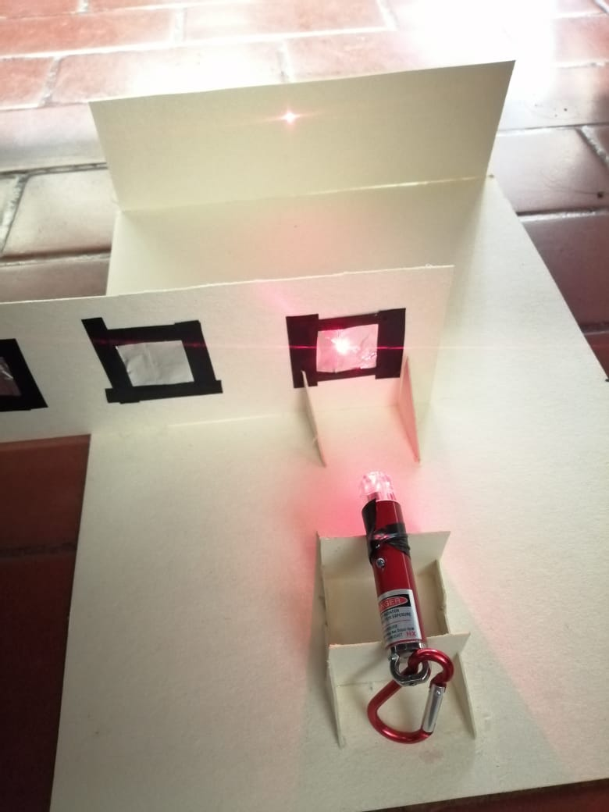
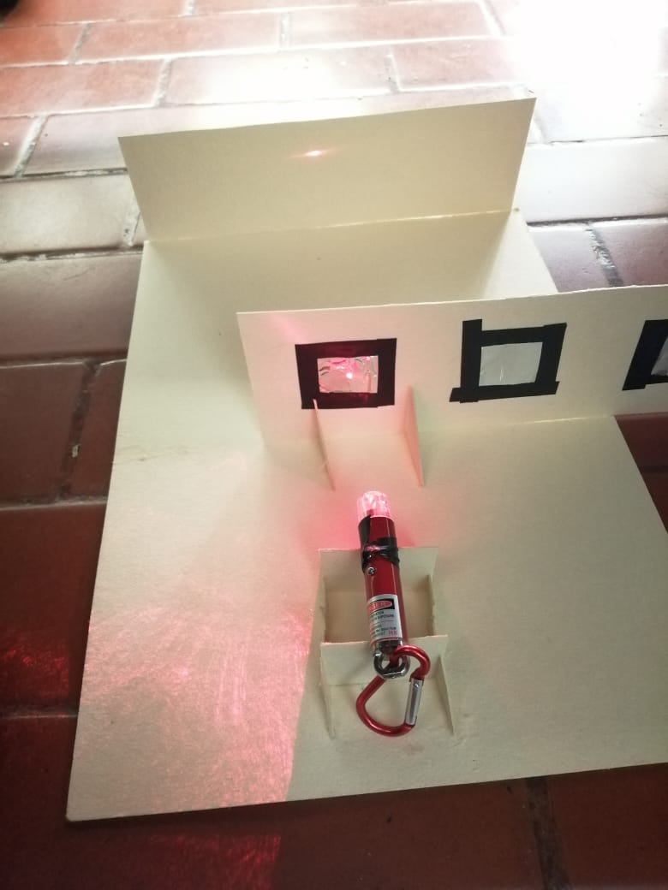

# Historia
El experimento de Young, realizado en 1801 por Thomas Young , con el fin de comprobar la naturaleza Ondulatoria de la luz .

## SIMULACION
* Con la librería  vectoresyMatricesComplejas.py  se buscó comprobar como surgia el patrón  en una simulacion cuántica tal y como se muestra a continuacion:

* Se logró observar como se generaba el efecto . A continuacion se procedio a ingresar un vector  de estado inicial.

* Luego ,  se procedio a ingresar el numero de rendijas del sistema , los blancos y el vector de probabilidades de cada rendija a cada blanco .
* Para hallar la matriz de probabilidades , se  halló el modulo al cuadrado de cada  uno de los numeros lo cual nos genera la siguiente matriz:

* Y por ultimo se ingreso el vector de estado en donde  el fotón se enuentra en la primra parte del sistema  de la siguiente forma 
Al terminar la simulacon se procedio a graficar el vector de estados resultantes: y el resultado fue el siguiente :

## Experimento
### Materiales 
Para la realizacion del experimento se realizo con los siguientes materiales  :
>- Cartón paja.
>- Láser común.
>- Silicona Líquida y en barra.
>- Aluminio.
>- cinta aislante.
>- Bisturí.
>- Regla.
## Procedimiento 🚀
*  Se hicieron varios cortes al carton paja para crear tanto  la pared donde se es proyectada la interferencia  para crear luego , las distintas rendijas por donde pasaba la luz estas a su vez se mueven mientras se deslizan a una distancia prudente del laser como de la pared.
*Para crear la rendija se hicieron cortes en una base rectangular en el cual se hicieron varios cortes con cuadrados de 3.5 cm separados a una distancia equidistante ,  luego con el bisturí se hicieron cortes sobre unos cuadrados de aluminio*1 , 2 y 3 cortes en cuada cuadro)  de una tamano mas grande que los cuadros hechos sobre la base rectangular de carton paja . Por ultimo , se pegaron con cinta aislante .
* Se unieron todos los componentes  a  un cuarto de cartón paja con silicona y se dio paso a la realizacion del experimento.

### Desarrollo 
Para realizar el experimento se procedio a colocar el laser sobre su base , siendo presionado con cinta aislante , luego se procedio a poner la base de 3 rectangular de rendijas sobre un soporte por el cual se va deslizando para que la luz del laser pasara por cada una de las rendijas , como se muestra a continuacion.

### Resultados ⚙️

A continuacion se muestran las Imagenes  del  fenomeno de interferencia ocasionado por cada una de las rendijas elaboradas.

### Conclusiones📋
En conclusion , se pudo observar y analizar como  la luz del laser tuvo dos comportamientos antes y despues de pasar por las rendijas , antes la luz se fragmentaba en cada una de las posibles rendijas por donde se podia pasar y luego de pasar por estas   se produce un fenomeno de interferencia haciendo que algunos lugares del patron se vean oscuros y otros mas claros , tal cual como sucede con la interferencia ondulatoria. Cuando mas aumentabamos el nivel de rendijas el patron se hacia mas alargado  tal como se mostrababa en las imagenes
según lo observado se ve que el resultado se asemeja más al comportamiento de ondas con el patrón de interferencia, pero esto en la época del experimento desconsternaba a los científicos el hecho de que al poner detectores después de la rendija para saber por dónde pasaba la luz el patrón del experimento era equivalente al de las partículas, lo que nos da entender que cuando el experimento está siendo monitoreado nos da como resultado el de las partículas y cuando no el resultado es el de patrón de interferencia de las ondas, como se muestra a continuación:

## Referencias
Inspirando en:

*Michael A. Nielsen, Isaac L. Chuang. Quantum Computation and Quantum Information (10th Anniversary edition). Cambridge University Press. 2016
